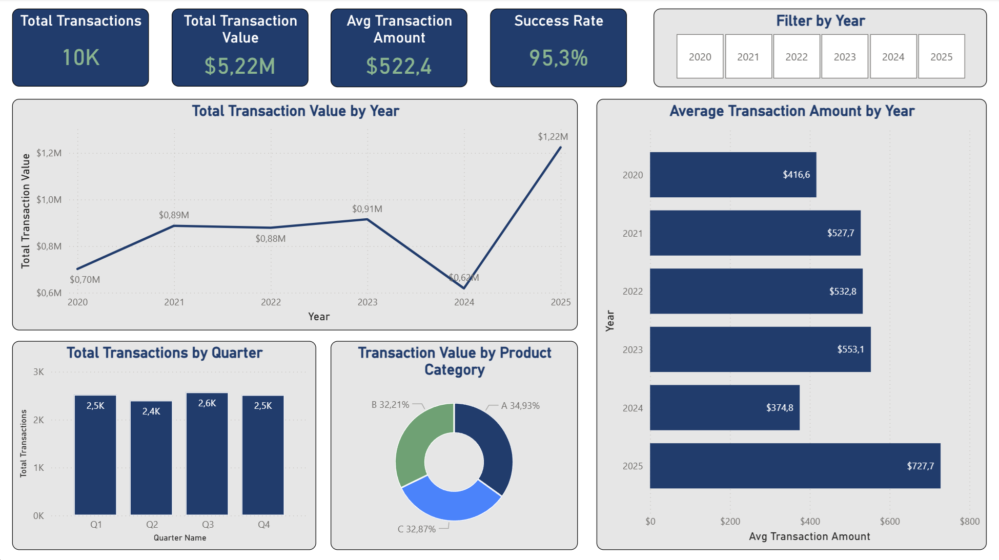
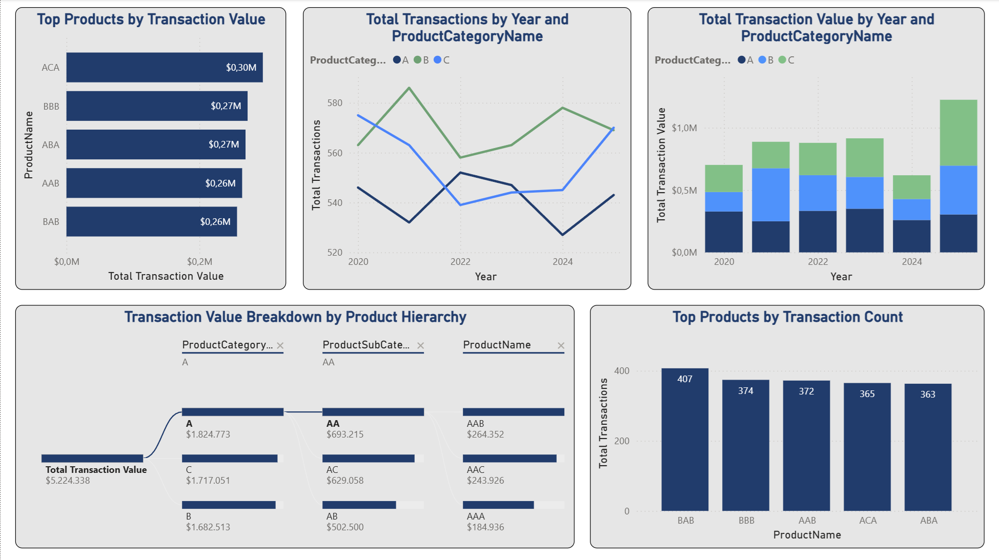
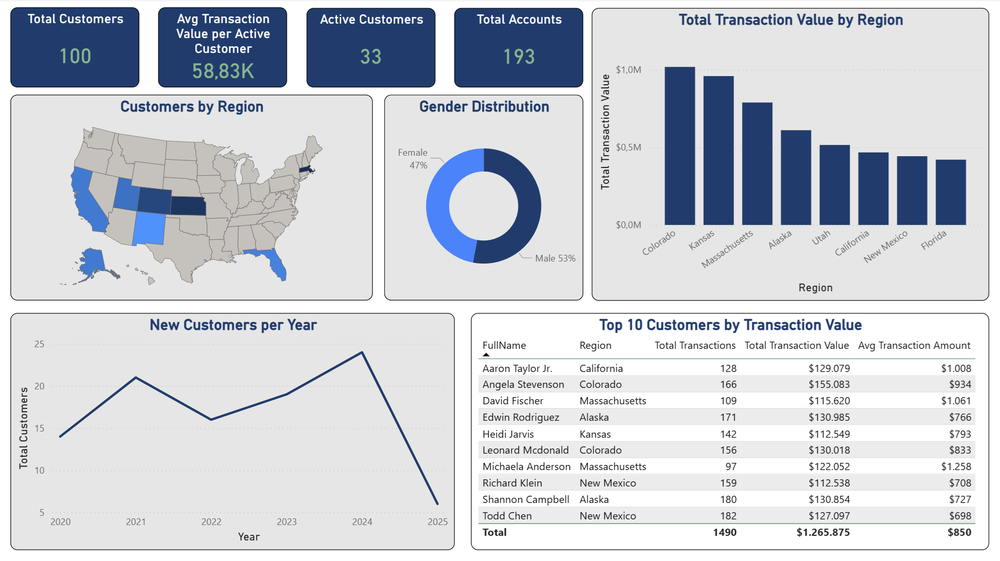
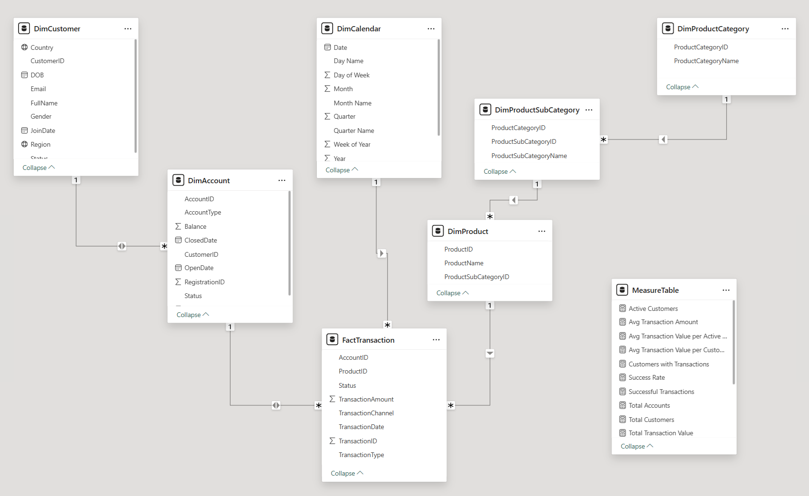
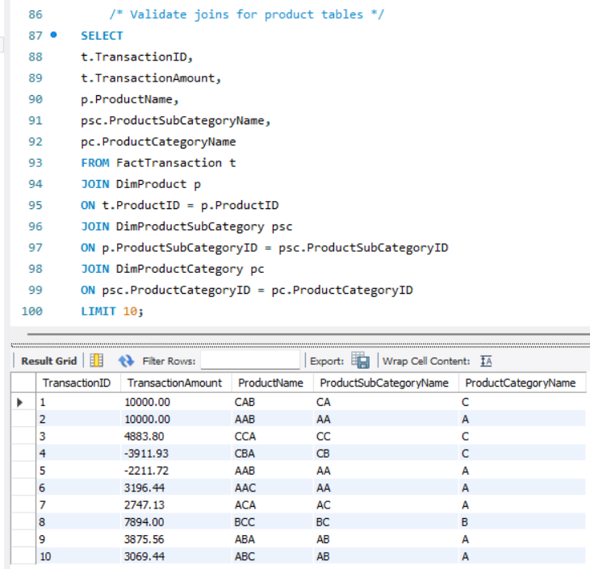
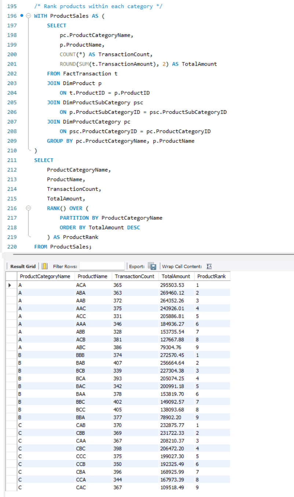
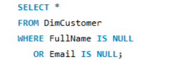
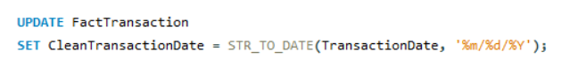
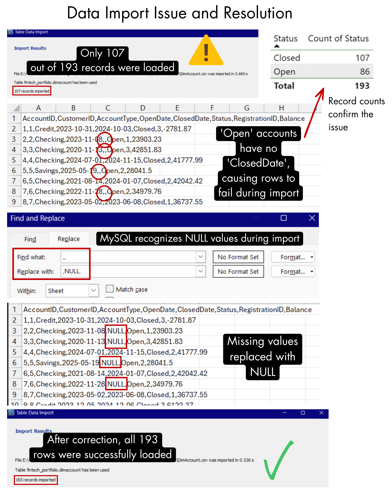

# FinTech Transactions Analysis (SQL + Power BI)

📊 SQL Analytics | 🏦 Financial Data Modeling | 📈 Business Insights

---

## Executive Summary

This project analyzes a fintech transactions dataset to understand customer behavior, product performance, and revenue distribution.

Using MySQL for data preparation and Power BI for visualization, a multi-page dashboard was developed to explore transaction trends, identify high-value customers, and evaluate product contribution across categories.

The analysis highlights that a small group of customers drives a large share of transaction value, while product performance remains relatively balanced across categories. These insights support more targeted customer strategies and data-driven business decisions.

---

## Dashboard

The Power BI dashboard provides an interactive view of transaction performance, customer activity, and product analysis across three pages.

It includes:
- KPI cards (Total Transactions, Total Value, Average Transaction Amount, Success Rate)
- Time-based analysis of transaction trends
- Product hierarchy breakdown (Category → Subcategory → Product)
- Customer segmentation by region and gender
- Identification of top-performing customers and products

### Page 1: Transaction Overview

### Page 2: Product Analysis

### Page 3: Customer Insights

---

## Business Problem

Financial platforms need to understand how customers interact with their products, where revenue is generated, and how user activity evolves over time.

Without structured analysis, it is difficult to:
- identify high-value customers
- understand which products drive revenue
- detect trends or declines in activity
- prioritize regions or segments for growth

This project aims to transform raw transactional data into actionable insights that support strategic decision-making.

---

## Dataset

Source: https://www.kaggle.com/datasets/saidaminsaidaxmadov/financial-transactions

The dataset is sourced from Kaggle and contains structured fintech transaction data used for analysis and modeling.

### Structure

The dataset consists of the following tables:

- **DimCustomer**  
Customer-level attributes such as demographics and status

- **DimAccount**  
Account-level information including balance and lifecycle status

- **FactTransaction**  
Core transactional data including amount, type, channel, and product

- **DimProduct / SubCategory / Category**  
Product hierarchy used for detailed analysis

### Dataset Characteristics

- ~100 customers  
- 193 accounts  
- Transaction-level dataset with multiple relationships  
- Designed as a **star schema model** for Power BI  

### Notes

- The dataset is publicly available on Kaggle and adapted for analytical use  
- Data required cleaning and validation before analysis  
- Some fields were initially loaded as text and converted to proper formats in SQL  
- Data issues (e.g. missing values) were identified and resolved during the process  

---

## Data Model

The Power BI model follows a **star schema structure**, with `FactTransaction` as the central table connected to multiple dimension tables.

This enables flexible analysis across:
- time
- product hierarchy
- customer attributes
- geographic regions

---

## Data Dictionary

A detailed data dictionary is available in the project files:

📄 [data_dictionary.xlsx](docs/data_dictionary.xlsx)

---

## Methodology

The project combines SQL and Power BI to perform end-to-end analysis.

### SQL (Data Preparation & Analysis)

- Created relational tables and validated data structure  
- Cleaned and transformed data (e.g. text → date conversion)  
- Handled missing values and data inconsistencies  
- Used:
  - JOINs for relational analysis  
  - aggregations (SUM, COUNT, AVG)  
  - window functions (RANK)  
  - CTEs for structured queries  

#### Example: Product Performance Analysis

#### Example: Product Ranking

#### Example: Data Validation

---

### Data Cleaning Example

Data type inconsistencies were handled directly in SQL:

---

### Data Import Issue & Resolution

During the process, a data import issue was identified and resolved:

- Only **107 out of 193 records** were initially loaded  
- Root cause: missing values in date fields  
- Solution: replace empty values with `NULL` before import  

---

## Results & Key Insights

- Transaction value shows an overall increasing trend over time  
- Average transaction size increased in later periods, indicating higher-value activity  
- Product categories contribute relatively evenly to total value  
- A small group of customers generates a large portion of total revenue  
- There is a gap between total and active customers, indicating engagement opportunities  
- Certain regions contribute more strongly to transaction value  

---

## Business Recommendations

Based on the analysis:

### 1. Focus on High-Value Customers
- Identify and retain top contributors  
- Offer personalized services or incentives  

### 2. Improve Customer Engagement
- Target inactive users with campaigns  
- Increase activity through product features or communication  

### 3. Optimize Product Strategy
- Expand well-performing categories  
- Monitor underperforming products  

### 4. Leverage Regional Insights
- Invest in high-performing regions  
- Explore growth opportunities in lower-performing areas  

---

## Limitations

- Synthetic dataset, not real-world data  
- Revenue is simplified and does not include long-term customer value or cancellations  
- No time-based cohort or retention analysis  
- External business factors are not included  
- Some data required manual cleaning due to format inconsistencies  
- Power BI dashboard is provided as a `.pbix` file only, as the free version does not support online publishing  

---

## Next Steps

- Perform customer retention analysis  
- Analyze time between key events  
- Introduce churn and lifetime value metrics  
- Segment customers based on behavior  
- Simulate A/B testing scenarios  

---

## Skills Demonstrated

### Technical Skills
- SQL (joins, aggregations, CTEs, window functions)  
- Power BI (data modeling, DAX, dashboard design)  
- Data cleaning and transformation  

### Analytical Skills
- Segmentation and aggregation  
- Trend analysis  
- KPI definition  
- Hierarchical analysis  

### Business Thinking
- Translating data into actionable insights  
- Identifying key drivers of value  
- Structuring dashboards for decision-making  
- Connecting data to business outcomes  

---
